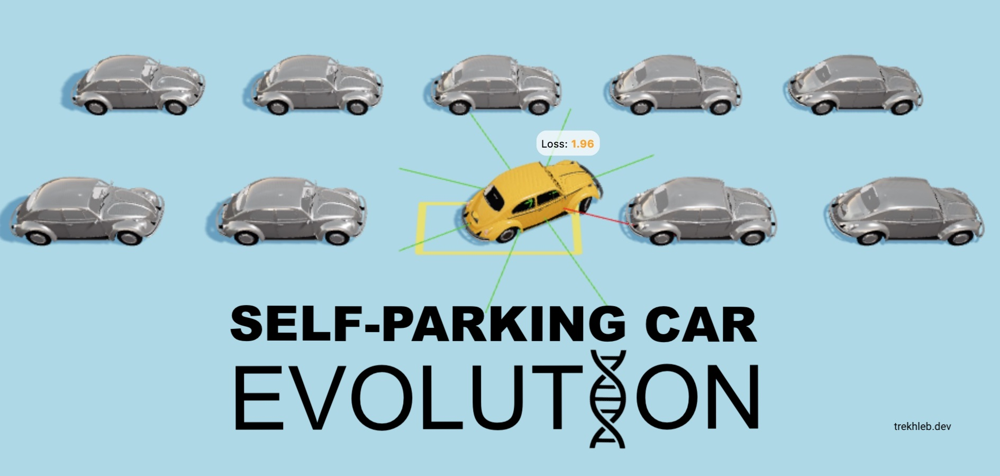
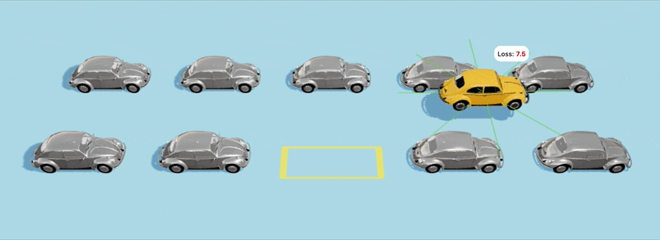

# 🧬 Self-Parking Car Evolution

Training the car to do self-parking using a genetic algorithm.

> - 🚕 [Launch the demo](https://trekhleb.dev/self-parking-car-evolution)
> - 📃 [Read about how it works](https://trekhleb.dev/blog/2021/self-parking-car-evolution/)

[](https://trekhleb.dev/self-parking-car-evolution)

This is an experimental project with the aim to learn the basics of how [genetic algorithm](https://en.wikipedia.org/wiki/Genetic_algorithm) works by teaching the cars to do the self-parking. The evolution process is happening directly in the browser. You may check the [evolution source-code](https://github.com/trekhleb/self-parking-car-evolution/tree/master/src/libs) (in TypeScript) or read the [explanation of how it works](https://trekhleb.dev/blog/2021/self-parking-car-evolution/) in my blog-post.

**At the beginning of the evolution** the generation of cars has random genomes which make them behave something like this:



**On the 40th generation** the cars start learning what the self-parking is and start getting closer to the parking spot (although hitting the other cars along the way):


Another example with a bit more challenging starting point:


## Genetic Source-Code

The `≈92%` of the code in this repository relates to the UI logic (3D simulation of the cars world, form controls for the evolution training process, etc.).

However, the actual [code that implements a genetic algorithm](https://github.com/trekhleb/self-parking-car-evolution/tree/master/src/libs) takes less than `<500` lines of code.

## Development Details

The project is a [React](https://create-react-app.dev/) application written on TypeScript. Styled with [BaseWeb](https://baseweb.design/).

The 3D world simulation is made with [Three.js](https://threejs.org/) library using [@react-three/fiber](https://github.com/pmndrs/react-three-fiber) wrapper. The physics is simulated with [Cannon.js](https://github.com/schteppe/cannon.js) using [cannon-es](https://github.com/pmndrs/cannon-es) wrapper.

The whole evolution simulation is happening directly in the browser.

To launch the project, fork/clone it and run the following commands:

```shell
npm install
npm run start
```

The website will be available on `http://localhost:3000/self-parking-car-evolution`.

**Hints:**

- You may upload one of the [pre-trained checkpoints](https://github.com/trekhleb/self-parking-car-evolution/tree/master/src/checkpoints) to avoid starting the evolution from scratch.
- Use the `?debug=true` URL param to see the FPS performance monitor and debugging logs in the console (i.e. `http://localhost:3000/self-parking-car-evolution?debug=true`).
- Training progress is being saved to the local storage for each generation (not for each batch/group).
